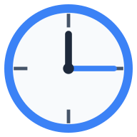

# 時計の差 トレーニング

時計の読み方と時間の差を楽しく学習できるウェブアプリケーションです。



## 概要

このアプリケーションは、2つの時計を表示し、その時間差を計算する練習ができる教育用ツールです。特に子供や時計の読み方を学習中の方々に向けて設計されています。

### 主な特徴

- 📱 **PWA対応** - オフラインでも動作し、ホーム画面に追加可能
- 🎯 **3つの難易度** - 簡単・普通・達人モードで段階的に学習
- 🌐 **多言語対応** - 漢字とひらがなの表示切り替え
- 🎉 **楽しい演出** - 正解時には紙吹雪アニメーション
- 📐 **レスポンシブデザイン** - スマートフォンからPCまで対応

## デモ

`public/index.html`をブラウザで開くだけで、すぐに使用できます。

## 技術スタック

- **フロントエンド**: 純粋なHTML, CSS, JavaScript
- **スタイリング**: Tailwind CSS (CDN)
- **フォント**: M PLUS Rounded 1c (Google Fonts)
- **アイコン生成**: Node.js + canvas

## セットアップ

### 基本的な使用方法

1. リポジトリをクローンまたはダウンロード
```bash
git clone [repository-url]
cd tokeikeisan
```

2. ブラウザで開く
```bash
open public/index.html
```

### アイコンの再生成（開発者向け）

アイコンを再生成する場合は、Node.jsが必要です。

1. 依存関係のインストール
```bash
bun install
# または
npm install
```

2. アイコンの生成
```bash
bun generate-icons.js
# または
node generate-icons.js
```

## 使い方

1. **難易度を選択**
   - 簡単: 15分単位の時間差
   - 普通: 5分単位の時間差
   - 達人: 1分単位の時間差

2. **問題を解く**
   - 2つの時計の時間を確認
   - 時間差を計算
   - 「時間」と「分」のボタンで答えを入力

3. **答え合わせ**
   - 「針を重ねてみる」ボタンで視覚的に確認
   - 「答え合わせ！」ボタンで正誤判定

## プロジェクト構造

```
tokeikeisan/
├── public/
│   ├── index.html          # メインアプリケーション
│   ├── manifest.json       # PWA設定
│   ├── favicon.png         # ファビコン
│   ├── favicon.svg         # SVGファビコン
│   ├── apple-touch-icon.png # iOS用アイコン
│   ├── icon-192.png        # PWAアイコン (192x192)
│   └── icon-512.png        # PWAアイコン (512x512)
├── generate-icons.js       # アイコン生成スクリプト
├── package.json           # Node.js依存関係
├── bun.lock              # Bunロックファイル
├── biome.json            # Biomeフォーマッター設定
├── devbox.json           # Devbox設定
├── devbox.lock           # Devboxロックファイル
├── .envrc                # direnv設定
├── .gitignore            # Git除外設定
└── README.md             # このファイル
```

## 開発環境

このプロジェクトは以下の開発ツールをサポートしています：

- **Bun**: 高速なJavaScriptランタイム
- **Biome**: コードフォーマッター
- **Devbox**: 開発環境管理ツール

## 機能の詳細

### 時計の表示
- Canvas APIを使用したアナログ時計の描画
- 時針と分針の正確な角度計算
- レスポンシブなサイズ調整

### 学習モード
- **簡単モード**: 0〜3時間の差、15分単位
- **普通モード**: 0〜6時間の差、5分単位
- **達人モード**: 0〜11時間59分の差、1分単位

### インタラクション
- 直感的なボタン操作
- 視覚的なフィードバック
- タッチデバイス対応

## ブラウザサポート

- Chrome (推奨)
- Firefox
- Safari
- Edge
- モバイルブラウザ

## 貢献

プルリクエストや改善提案を歓迎します。

## ライセンス

このプロジェクトはオープンソースです。詳細なライセンス情報は後日追加予定です。

---

楽しく時計の学習をしましょう！ 🕐